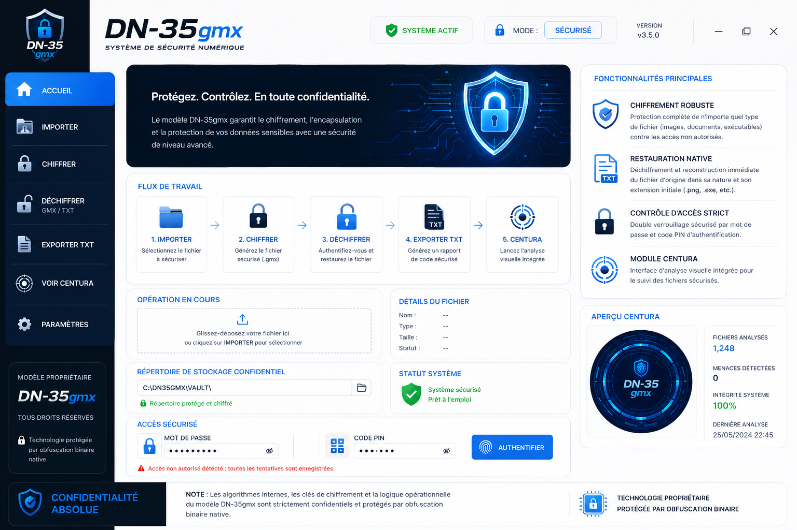

  

  <a href="#-français"><b>🇫🇷 Français</b></a> • 
  <a href="#-english"><b>🇬🇧 English</b></a> • 
  <a href="#-arabic"><b>🇲🇦 العربية</b></a>

---

# 🇫🇷 GEN-D : Moteur de Chiffrement Next-Gen

  
  
  

## 💻 À Propos de GEN-D
**GEN-D** est une solution propriétaire de cyber-sécurité et de chiffrement de fichiers de nouvelle génération. Basé sur l'architecture robuste **DN-35gmx**, ce système applique des protocoles d'encapsulation avancés pour sécuriser les données sensibles contre toute tentative d'interception.
* **Sécurité Boîte Noire :** Les algorithmes et la logique opérationnelle (Chronometre 15 min, Anti-VM) sont compilés en code machine natif pour empêcher la rétro-ingénierie.

## 🚀 Caractéristiques Clés
* **Chiffrement Multi-Format :** Protection instantanée de vos fichiers (images, documents, exécutables).
* **Restauration Native :** Reconstruction parfaite du fichier d'origine avec son extension initiale (`.png`, `.exe`, etc.).
* **Contrôle d'Accès Strict :** Double barrière via clé d'authentification et code PIN.
* **Protection Active :** Détection automatique des menaces (Anti-VM, Anti-Sniffing de trafic, et Anti-Clock Rollback).

## 📂 Structure du Dépôt (Deployment)
* **`main_ui.py`** : L'interface utilisateur graphique (GUI) publique.
* **`dn35_core.cpython-312-x86_64-linux-gnu.so`** : Le cœur binaire fermé (Contient le Chronomètre Python 3.12).
* **`gen.png`** : Le visuel officiel du projet.

## ⚠️ Version d'Évaluation (DEMO)
Ce dépôt contient la version d'évaluation. Le système s'arrête automatiquement après **15 minutes** d'exécution. Pour acquérir la version professionnelle illimitée, veuillez contacter le développeur.

---

# 🇬🇧 GEN-D: Next-Gen Encryption Engine

  
  
  

## 💻 About GEN-D
**GEN-D** is a next-generation proprietary cybersecurity and file encryption solution. Powered by the robust **DN-35gmx** architecture, this system applies advanced encapsulation protocols to secure sensitive data against interception.
* **Black-Box Security:** All core algorithms and operational logic (15-Min Chronometer, Anti-VM) are compiled into native machine code to completely prevent reverse engineering.

## 🚀 Key Features
* **Multi-Format Encryption:** Instant protection for any file type (images, documents, executables).
* **Native Restoration:** Flawless reconstruction of the original file with its initial extension (`.png`, `.exe`, etc.).
* **Strict Access Control:** Double security barrier using an authentication key and a PIN code.
* **Active Protection:** Automated threat detection including Anti-VM, Network Traffic Anti-Sniffing, and System Clock Rollback protection.

## 📂 Repository Structure
* **`main_ui.py`**: The public Graphical User Interface (GUI).
* **`dn35_core.cpython-312-x86_64-linux-gnu.so`**: The closed native binary core (Python 3.12).
* **`gen.png`**: The official project banner image.

## ⚠️ Evaluation Version (DEMO)
This repository contains the evaluation version. The system automatically terminates after **15 minutes** of execution. To acquire the unlimited professional version, please contact the developer.

---

# 🇲🇦 جين-دي (GEN-D) : محرك تشفير من الجيل الجديد

  
  
  

## 💻 حول نظام GEN-D
برنامج **GEN-D** هو حل برمجيات خاص ومتقدم للأمن السيبراني وتشفير الملفات من الجيل الجديد. يعتمد النظام على بنية **DN-35gmx** القوية، ويطبق بروتوكولات تغليف متطورة لتأمين البيانات الحساسة ضد أي محاولات اعتراض أو اختراق.
* **أمان الصندوق الأسود (Black-Box):** تم تجميع الخوارزميات الداخلية ومنطق التشغيل (كرونوميتر 15 دقيقة، حظر الأنظمة الوهمية) بالكامل في كود آلي ثنائي مغلق لمنع الهندسة العكسية تماماً.

## 🚀 الميزات الرئيسية
* **تشفير متعدد الصيغ:** حماية فورية لجميع أنواع الملفات (الصور، المستندات، والملفات التنفيذية).
* **استعادة أصلية:** إعادة بناء الملف الأصلي بدقة عالية مع الحفاظ على امتداده الأولي (`.png` ، `.exe`، إلخ).
* **تحكم صارم في الوصول:** جدار حماية مزدوج يتطلب كلمة مرور مع رمز PIN سري.
* **حماية نشطة:** كشف تلقائي للتهديدات يشمل حظر الأنظمة الوهمية (Anti-VM)، منع مراقبة حزمة البيانات (Anti-Sniffing)، وحماية ساعة النظام من التلاعب.

## 📂 بنية المستودع
* **`main_ui.py`**: واجهة المستخدم الرسومية العامة.
* **`dn35_core.cpython-312-x86_64-linux-gnu.so`**: النواة الثنائية المغلقة للمحرك (تحتوي على نظام الـ 15 دقيقة لـ Python 3.12).
* **`gen.png`**: الصورة الرسمية لواجهة المشروع.

## ⚠️ نسخة التقييم (DEMO)
يحتوي هذا المستودع على النسخة التجريبية فقط. يتوقف النظام عن العمل تلقائياً بعد **15 دقيقة** من التشغيل. للحصول على النسخة الاحترافية غير المحدودة، يرجى التواصل مع المطور.

---

<i>Propriété Intellectuelle Protégée — Modèle GEN-D 2026</i>

