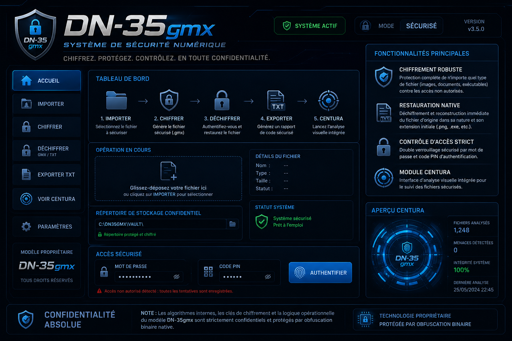

  

  

  
  
  

## 🚀 À propos de GEN-D
**GEN-D** est une solution propriétaire de cyber-sécurité et de chiffrement de fichiers de nouvelle génération, basée sur l'architecture robuste **DN-35gmx**. 

- **Sécurité Boîte Noire :** Algorithmes et logique opérationnelle (Chronometre 15 min, Anti-VM) compilés en code machine natif pour empêcher la rétro-ingénierie.
- **Accès Rapide :** Utilisez notre portail Web pour accéder aux outils de déploiement et à la documentation.

---

<i>Propriété Intellectuelle Protégée — Modèle GEN-D 2026</i>

