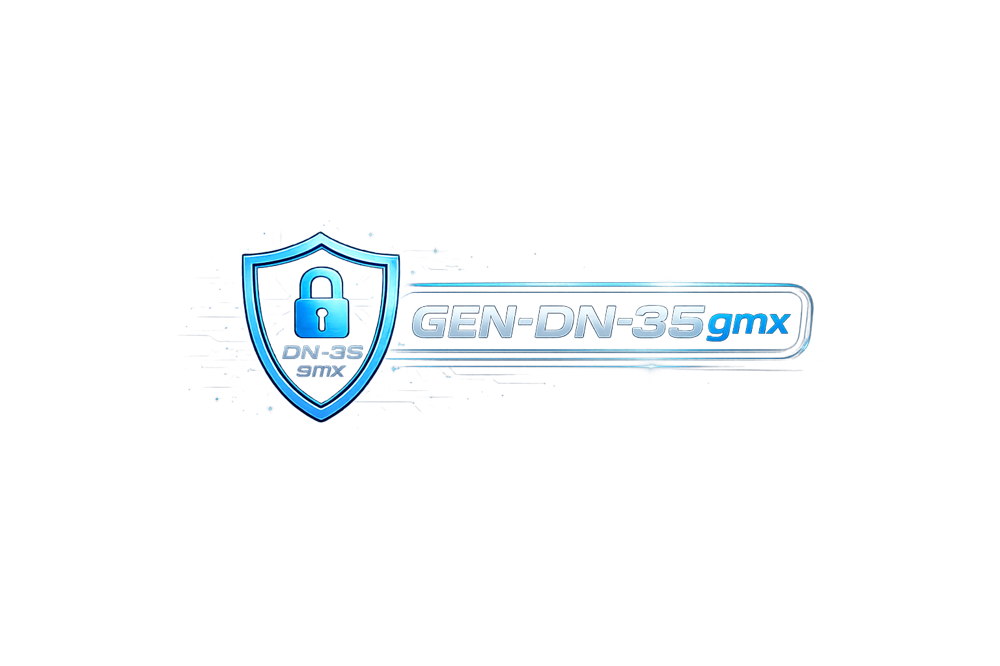

  

  <a href="#-français"><b>🇫🇷 Français</b></a> • 
  <a href="#-english"><b>🇬🇧 English</b></a> • 
  <a href="#-arabic"><b>🇲🇦 العربية</b></a>

  

---

# 🇫🇷 GEN-D : Moteur de Chiffrement Next-Gen

  
  
  

## 💻 À Propos de GEN-D
**GEN-D** est une solution propriétaire de cyber-sécurité et de chiffrement de fichiers de nouvelle génération, basée sur l'architecture robuste **DN-35gmx**. 
* **Sécurité Boîte Noire :** Algorithmes et logique opérationnelle (Chronometre 15 min, Anti-VM) compilés en code machine natif pour empêcher la rétro-ingénierie.

## 🚀 Caractéristiques Clés
* **Interface Web Interactive :** Accédez à notre portail de démonstration en un clic.
* **Chiffrement Multi-Format :** Protection instantanée de vos fichiers.
* **Protection Active :** Anti-VM, Anti-Sniffing de trafic, et Anti-Clock Rollback.

---

# 🇬🇧 GEN-D: Next-Gen Encryption Engine

  
  
  

## 💻 About GEN-D
**GEN-D** is a next-generation proprietary cybersecurity and file encryption solution powered by the **DN-35gmx** architecture.

## 🚀 Key Features
* **Live Web Portal:** Experience the demo interface directly in your browser.
* **Black-Box Security:** Native compiled binary core.
* **Active Protection:** Threat detection including Anti-VM and Anti-Clock Rollback.

---

# 🇲🇦 جين-دي (GEN-D) : محرك تشفير من الجيل الجديد

  
  
  

## 💻 حول نظام GEN-D
برنامج **GEN-D** هو حل أمني سيبراني متطور يعتمد على بنية **DN-35gmx** لتأمين البيانات وحمايتها من الهندسة العكسية.

## 🚀 الميزات الرئيسية
* **بوابة ويب تفاعلية:** جرب النسخة التجريبية مباشرة عبر المتصفح.
* **حماية الصندوق الأسود:** نظام مغلق ومجمع بالكامل لضمان أقصى حماية.
* **الحماية النشطة:** نظام مدمج لكشف التلاعب بالساعة والأنظمة الوهمية.

---

<i>Propriété Intellectuelle Protégée — Modèle GEN-D 2026</i>

